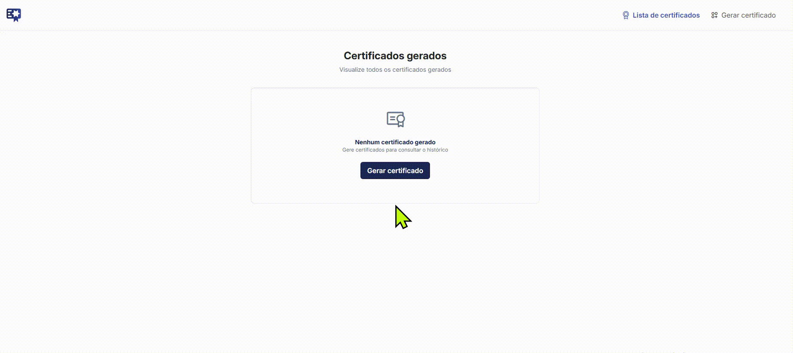

# Gerador Certificado

Este projeto é uma aplicação Angular para geração de certificados.

## Estrutura do Projeto

- **src/**: Código-fonte principal
  - **main.ts**: Ponto de entrada da aplicação
  - **styles.css**: Estilos globais
  - **index.html**: HTML principal
  - **app/**: Módulo principal da aplicação
    - **app.component.\***: Componente raiz
    - **app.config.ts**: Configurações da aplicação 
    - **app.routes.ts**: Rotas da aplicação
    - **components/**: Componentes reutilizáveis
    - **interfaces/**: Interfaces TypeScript
    - **pages/**: Páginas da aplicação
    - **services/**: Serviços de negócio e integração
- **public/**: Recursos públicos (ex: imagens, certificados, navbar)
- **.angular/**: Cache do Angular
- **.vscode/**: Configurações do Visual Studio Code

## Scripts

- `npm install`: Instala as dependências
- `npm start`: Inicia o servidor de desenvolvimento
- `npm run build`: Compila o projeto para produção
- `npm test`: Executa os testes unitários

## Configuração

- **angular.json**: Configurações do Angular CLI
- **tsconfig.json**: Configuração do TypeScript
- **netlify.toml**: Configuração de deploy no Netlify
- **.editorconfig**: Padrões de formatação
- **.gitignore**: Arquivos ignorados pelo Git

## Testes

Os testes unitários estão localizados em arquivos `*.spec.ts` dentro da pasta `src/app/`.

## Deploy

O projeto pode ser facilmente publicado no Netlify utilizando o arquivo `netlify.toml`.

## Como rodar localmente

1. Instale as dependências:
   ```sh
   npm install
   ```
2. Inicie o servidor de desenvolvimento:
   ```sh
   npm start
   ```
3. Acesse `http://localhost:4200` no navegador.

## Licença

Este projeto está sob licença MIT.

## Deploy do Projeto

https://geradordcertificados.netlify.app



---